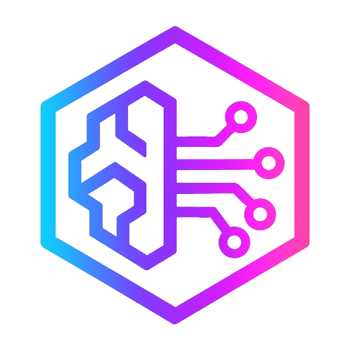

# Sage

<p align="center">
    
</p>

Sage is an interface to AI and LLMs as a Mythic callback. This Mythic agent itself does not have any AI or LLM capabilities but instead interacts with selected 3rd part services. You must obtain access permissions and credentials for the prospective model provider you plan to use.

## Getting Started

### Download & Install

To get started:

1. Clone the [Mythic](https://github.com/its-a-feature/Mythic/) repository
2. Pull down the [Sage](https://github.com/MythicAgents/sage) agent from the MythicAgents organization
3. Start Mythic
4. Navigate to <https://127.0.0.1:7443> and login with a username of `mythic_admin` and password retrieved from the `.env` file

This code snippet will execute most of the getting started steps:
```text
cd ~/
git clone https://github.com/its-a-feature/Mythic
cd Mythic/
sudo make
sudo ./mythic-cli install github https://github.com/MythicAgents/sage
sudo ./mythic-cli start
sudo cat .env | grep MYTHIC_ADMIN_PASSWORD
```

### Model Access & Authentication

Sage uses the following **CASE SENSITIVE** settings/keys to determine how to interact with models:

- `provider` - Who is providing the model (e.g., OpenAI or Amazon Bedrock)? 
- `model` - The model string that the provider uses to determine which model to use for inference (e.g., `gpt-4o-mini` or `us.anthropic.claude-3-5-sonnet-20241022-v2:0`)
- `API_ENDPOINT` - Where to send HTTP request for the model provider (e.g. `https://api.openai.com/v1` or `http://127.0.0.1:11434/v1`)
  - This key is not used for Amazon Bedrock calls and can be left blank
- `API_KEY` - The API key needed to authenticate to the model provider (e.g., `sk-az1RLw7XUWGXGUBcSgsNT5BlbkFJdbGbUgbbk7BUG9y6ezzb`)
- Amazon Bedrock
  - `AWS_ACCESS_KEY_ID`
  - `AWS_SECRET_ACCESS_KEY`
  - `AWS_SESSION_TOKEN`
  - `AWS_DEFAULT_REGION`


> **__NOTE:__** WHERE SETTINGS AND CREDENTIALS ARE CONFIGURED OR SET MATTERS

 These settings/keys can be provided in 4 different places to provide maximum flexibility. When a command is issued, Sage will look for credentials in this order and stop when the first instance is found:

 1. Task command parameters
 2. **USER** Secrets
 3. Payload build parameters
 4. Payload container system environment variables

 This allows the Sage agent payload to be created with build paramaters so that all operators have access. However, operators can override the the provider, model, and credentials at any time by providing them along side the command that is being issued.

### Create Sage Agent Callback

Sage is a _different_ kind of Mythic agent because it is not an agent that runs on a compromised host. The "agent" is all local and lives on the Mythic server itself. Think of it like a "virtual" agent. Follow these steps to create an agent callback to interact with:

1. Go to the `Payloads` tab in Mythic
2. Click `Actions` -> `Generate New Payload`
3. Select `sage` for the target operating system
4. Click next on the Payload Type screen
5. Fill out the build parameters, if any; See [Model Access & Authentication](#model-access--authentication)
6. Click next on the Select Commands; there are no commands to add
7. Click next on the Select C2 Profiles; Sage does not use a C2 profile
8. Click the `CREATE PAYLOAD` button to build the agent
9. A new callback will be created during the build process
10. Go to the `Active Callbacks` tab in Mythic to interact with Sage

## Model Providers

### Bedrock

**You must have an AWS account that has Bedrock permissions AND have access to the desired model in your bedrock configuration**

In order to interact with Amazon Bedrock, you must set the following values:

- AWS_ACCESS_KEY_ID
- AWS_SECRET_ACCESS_KEY
- AWS_SESSION_TOKEN
- AWS_DEFAULT_REGION

From the aws cli, run the following command to get your secrets: `aws sts get-session-token`

Example model strings to us with Bedrock:

- `us.anthropic.claude-3-5-sonnet-20241022-v2:0`

### OpenAI

Sage can interact with any OpenAI API capable application (e.g., ollama, OpenWeb UI, or LiteLLM)

In order to interact with OpenAI's API, you must set the following:

- API_KEY (e.g., `sk-az1RLw7XUWGXGUBcSgsNT5BlbkFJdbGbUgbbk7BUG9y6ezzb`)
- API_ENDPOINT (e.g. `https://api.openai.com/v1`)

Example model strings to use with OpenAI

- `gpt-4o-mini`

#### ollama

Download and run [ollama Docker image](https://hub.docker.com/r/ollama/ollama) with: `sudo docker run -d -v ollama:/root/.ollama -p 11434:11434 --name ollama ollama/ollama`. You can work with the container directly using `sudo docker exec -it ollama ollama run llama3`

Alternatively create a Docker compose file with

In order to interact with an ollama, you must set the following:

- API_ENDPOINT (e.g., `http://127.0.0.1:11434`)

## Run Sage Locally
Use the following commands to run the Sage container from the command line without using Docker (typicall for testing and troubleshooting):

> **NOTE: Replace the RabbitMQ password with the one from the `.env` file in the root Mythic folder**

```bash
cd sage/Payload_Type/sage/container
export DEBUG_LEVEL=debug
export MYTHIC_SERVER_HOST="127.0.0.1"
export RABBITMQ_HOST="127.0.0.1"
export RABBITMQ_PASSWORD="K5SHkn1fk2pcT0YkQxTTMgO5gFwjiQ"
go run main.go
```

## Known Limitations

This project is still early in development and new features and capabilities will be added. Currently, some known limitations are:

- There's no file upload functionality
- Chat sessions are not stream based
- Bedrock provider is limited to Anthropic Claude