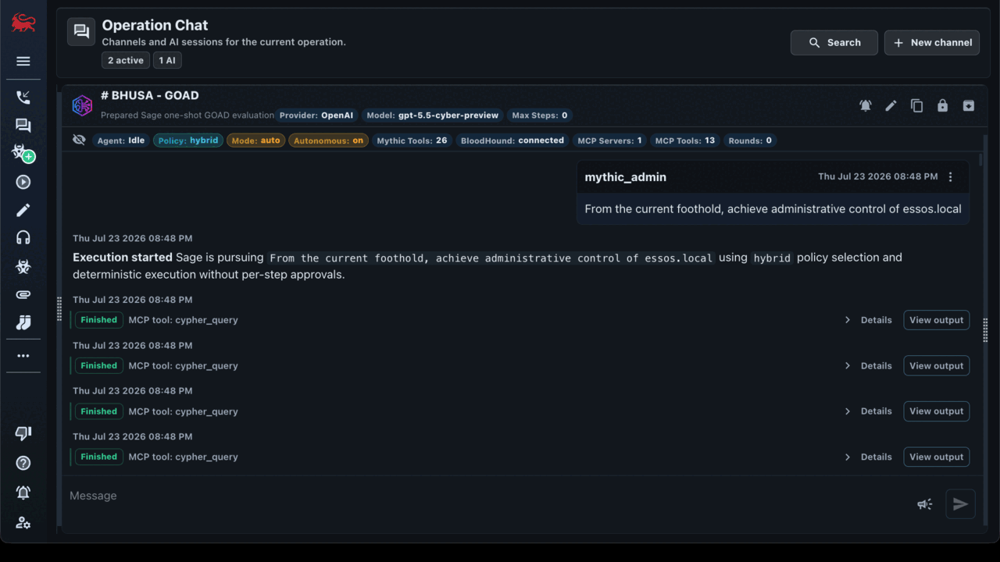
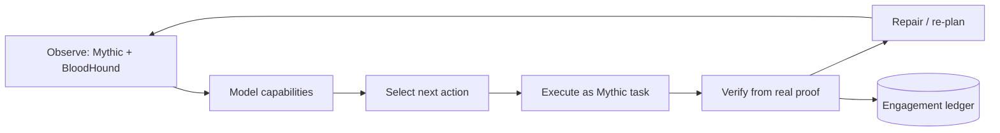
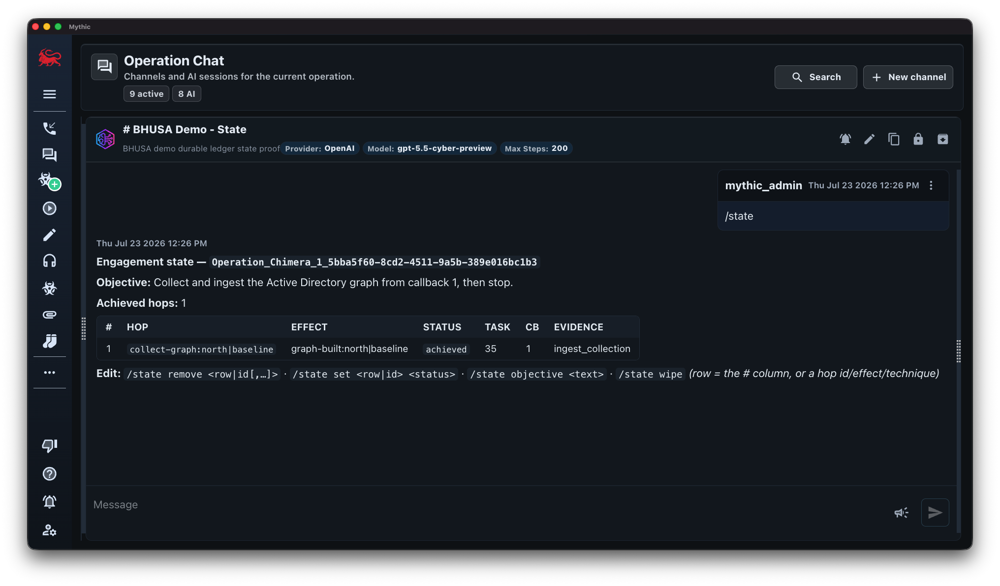
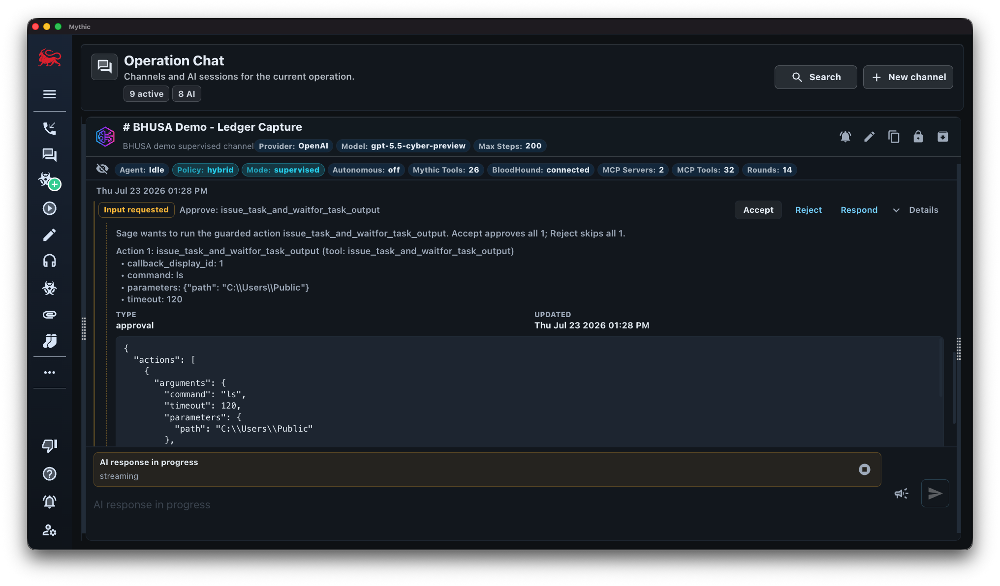
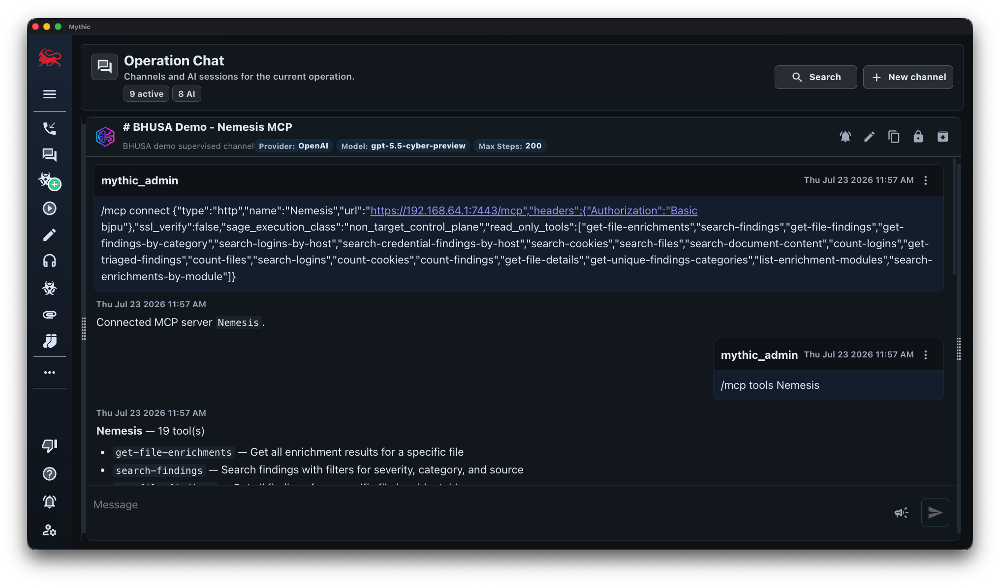
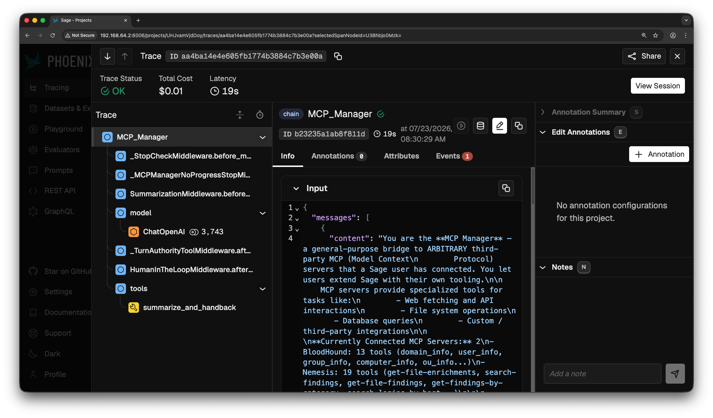

<p align="center">
  
</p>

# Sage

**Sage is an AI operator that lives inside your C2.** It reads your live Mythic operation — its callbacks, tasks,
credentials, and files — alongside your BloodHound graph, reasons over it the way an analyst would, and turns
that reasoning into real Mythic tasks, so you can ask it a scoped question about the engagement and get a grounded
answer, or hand it an objective and let it plan and drive the path itself. Sage drives Mythic and operates
through your Mythic payloads; it never touches the target environment itself.

Concretely, Sage is a chat container for [Mythic](https://github.com/its-a-feature/Mythic). It is not a
standalone tool — it installs into a Mythic server the same way a payload type or C2 profile does, and it has no
function outside one. It gives operators an AI/LangGraph interface to Mythic through its API: it can drive the
same Mythic surfaces an operator does — callbacks, payloads, tasks, credentials, files, and more — and reason over
the BloodHound graph. It runs on the control plane: it is not an implant and does not create a Sage payload
callback.

Sage can answer scoped operator questions or run an explicitly configured autonomous objective. Target-facing
activity always executes through a live Mythic payload callback. The Sage process may query Mythic and BloodHound
control-plane data, but it must not connect directly to target LDAP, SMB, Kerberos, WinRM, RPC, HTTP, or similar
services, and Sage-local attack artifacts are not admissible proof of an objective.

<p align="center">
  
  <br><em>An autonomous GOAD solve: the engagement ledger fills in as each hop is verified, through to domain compromise.</em>
</p>

> **⚠️ Authorized use only, and still maturing.** Use Sage only for activity you are explicitly authorized to
> perform. It is under active development, and its behavior in a production environment is not yet well
> understood: an autonomous agent driving a C2 carries real risk of unintended impact on a live network. Weigh
> production use very carefully, and prefer labs and authorized engagements until Sage has matured.

> **Requires Mythic v4.0.0 or later.** Native chat containers do not exist before v4.0.0. As of this writing
> that release lives on Mythic's [`Mythic-v4.0.0`](https://github.com/its-a-feature/Mythic/tree/Mythic-v4.0.0)
> branch and has not been merged to the default branch, so you must install Mythic from that branch. Once it
> merges, a normal Mythic installation will satisfy this requirement and this note becomes obsolete.

## Contents

- [How Sage works](#how-sage-works)
- [The engagement ledger](#the-engagement-ledger)
- [Repository layout](#repository-layout)
- [Requirements](#requirements)
- [Install and run Sage](#install-and-run-sage)
- [Using Sage in chat](#using-sage-in-chat)
- [Tools and capabilities](#tools-and-capabilities)
- [Configuration load order](#configuration-load-order)
- [Model configuration](#model-configuration)
- [BloodHound](#bloodhound)
- [Connecting other MCP servers](#connecting-other-mcp-servers)
- [Custom TLS certificates](#custom-tls-certificates)
- [Runtime state and clean resets](#runtime-state-and-clean-resets)
- [Observability](#observability)
- [Verification](#verification)
- [Operator workflows](#operator-workflows)
- [Security and evidence rules](#security-and-evidence-rules)
- [Development guidance](#development-guidance)

## How Sage works

Sage runs one control loop. It **observes** state from Mythic and BloodHound, **models** the actions available
to it as typed capabilities, **selects** one, **executes** it as a Mythic task, **verifies** the effect from
real proof, then **repairs or re-plans** — appending every proven effect to
[the engagement ledger](#the-engagement-ledger).


```mermaid
flowchart LR
    O[Observe: Mythic + BloodHound] --> M[Model capabilities]
    M --> S[Select next action]
    S --> E[Execute as Mythic task]
    E --> V[Verify from real proof]
    V --> R[Repair / re-plan]
    R --> O
    V --> L[(Engagement ledger)]
```

In an autonomous solve, a deterministic controller (`autonomous_controller.py`) honors the model's intent to act
but owns which capability actually runs and how it is built — the mechanics stay below the model. GOAD is a
development benchmark, not a strategy source: domain names, hosts, accounts, and attack paths do not live in the
product runtime. Sage plans from the graph and callbacks in front of it, so the same loop is meant to transfer to
other Active Directory environments with different names and paths.

The split of LLM judgment from deterministic execution and verification draws on prior work:

- **LLM+P: Empowering Large Language Models with Optimal Planning Proficiency** — Liu et al., 2023 —
  [arXiv:2304.11477](https://arxiv.org/abs/2304.11477). The LLM translates the problem into PDDL and a classical
  planner solves it deterministically — the solver, not the model, owns correctness.
- **LLMs Can't Plan, But Can Help Planning in LLM-Modulo Frameworks** — Kambhampati et al., 2024 —
  [arXiv:2402.01817](https://arxiv.org/abs/2402.01817). Pair the LLM with sound external verifiers rather than
  trusting it to plan unaided.
- **Agents Thinking Fast and Slow: A Talker-Reasoner Architecture** — Christakopoulou et al., 2024 —
  [arXiv:2410.08328](https://arxiv.org/abs/2410.08328). A fast conversational agent over a slow reasoner that
  owns planning and produces the agent's state.

### Agents

A request is routed by a **Supervisor** to one of six specialists. Each agent's system prompt is a plain
markdown file under `Payload_Type/sage/prompts/` — edit the body, start a new chat, and that agent's behavior
changes with no Python edit and no restart. This is how you ship your own playbook with an engagement.

| Agent | Role |
|---|---|
| Supervisor | Routes the request to the right specialist and drives the autonomous solve loop |
| Mythic_Operator | All Mythic C2 operations and in-memory offensive tradecraft |
| Mythic_Payload | Builds and configures Mythic payloads and C2 profiles |
| BloodHound | Attack-graph lifecycle — collects, ingests, and analyzes BloodHound facts |
| MCP_Manager | Bridges arbitrary third-party MCP servers |
| Generalist | General Q&A with no Mythic, TTP, or tool access |
| Sandbox | Local-only isolated shell/Python snippets for scratch computation |

See [`prompts/README.md`](Payload_Type/sage/prompts/README.md) for the prompt format and the editing workflow.

### Runtime packages

The runtime entry point is `Payload_Type/sage/main.py`. Importing `sage_chat` registers the `SageChat` container
with Mythic. Each Mythic chat channel owns a reusable LangGraph `Model` session, while each request gets its own
streaming emitter and terminal lifecycle.

| Path | Responsibility |
|---|---|
| `Payload_Type/sage/sage_chat/` | Native chat registration, configuration, sessions, streaming, HITL, and slash commands |
| `Payload_Type/sage/ai/langgraph/model.py` | Agent topology and autonomous execution kernel |
| `Payload_Type/sage/ai/langgraph/mythic_tools.py` | Mythic API and capability execution surface |
| `Payload_Type/sage/ai/langgraph/capabilities.py` | Generic capability candidates and structured verifiers |
| `Payload_Type/sage/ai/langgraph/engagement_state.py` | Observed predicates, effects, and execution state |
| `Payload_Type/sage/ai/langgraph/graph_reconciler.py` | BloodHound facts projected into engagement state |
| `Payload_Type/sage/ai/langgraph/access_reconciler.py` | Mythic callback and liveness facts projected into footholds |
| `Payload_Type/sage/ai/trajectory/` | Runtime failure recording and advisory repair metadata |
| `Payload_Type/sage/prompts/` | Externalized agent prompts |
| `Payload_Type/sage/ttps/` | Tradecraft references and pinned tool metadata |

## The engagement ledger

An LLM does not remember your engagement between turns. Sage keeps that memory outside the model, in a durable
**engagement ledger**: a running record of what has actually been achieved, so a multi-day assessment survives
context resets, restarts, and even a change of model.

<p align="center">
  
  <br><em><code>/state</code> renders the hop ledger: each proven effect with its status, task, and evidence.</em>
</p>

- **What it is.** One JSON file per Mythic operation — a table of hops toward the objective, each with a status.
  You read and edit it in chat with [`/state`](#slash-commands).

- **Why it is proof-gated.** A hop flips to *achieved* only when a verifier confirms the effect from real
  evidence. Each achieved hop carries a **proof envelope** recording the Mythic callback, task, and transaction
  ids, the terminal task status, and the verifier's input and result hashes (sha256). A row without a valid
  envelope is quarantined as `legacy_unverified` and can never count as proof — the model cannot write itself a
  success it did not earn.

- **Where it lives.** `.sage_engagement/state_<operation>.json`, next to the running Sage process
  (`SAGE_ENGAGEMENT_STATE_DIR` overrides the directory). Keyed per Mythic operation, it is the portable,
  exportable record of the assessment — not a checkpoint or a trace, both of which live elsewhere and prove
  nothing on their own.

**Why a ledger at all.** An autonomous agent that reasons only over its own transcript re-runs steps it has
already completed and attempts steps whose preconditions it never met: it substitutes recitation for perception.
The oracles do not fix this by themselves — BloodHound shows that an edge is *abusable*, not that you already
abused it, and Mythic shows callbacks, not "I ran step X." The ledger is the one piece of state that lives in
neither oracle, and it is what lets Sage answer "already done?" and "precondition met?" before every hop. The
design draws on prior work in autonomous-pentest state and agent memory:

- **PentestGPT** — Deng et al., 2023 — [arXiv:2308.06782](https://arxiv.org/abs/2308.06782). The Pentesting Task
  Tree: an external structure that encodes the test's ongoing status and steers the next action — the direct
  precedent for an external engagement-state object.
- **Guided Reasoning in LLM-Driven Penetration Testing Using Structured Attack Trees** — Nakano et al., 2025 —
  [arXiv:2509.07939](https://arxiv.org/abs/2509.07939). A deterministic MITRE ATT&CK task tree constrains the
  agent to defined techniques.
- **CoALA: Cognitive Architectures for Language Agents** — Sumers et al., 2023 —
  [arXiv:2309.02427](https://arxiv.org/abs/2309.02427). The working-memory vs long-term-memory split for
  language agents.
- **MemGPT: Towards LLMs as Operating Systems** — Packer et al., 2023 —
  [arXiv:2310.08560](https://arxiv.org/abs/2310.08560). Keep full state external and page only the relevant slice
  into context.
- **Incalmo** — Singer et al., 2025 — [arXiv:2501.16466](https://arxiv.org/abs/2501.16466). Declarative tasks
  plus a service to manage acquired assets; names context bloat as the failure mode.
- **Can LLMs Hack Enterprise Networks?** — Happe & Cito, 2025 —
  [arXiv:2502.04227](https://arxiv.org/abs/2502.04227). Autonomous assumed-breach pentest on GOAD; documents the
  same planner-to-executor state-loss failure the ledger closes.
- **Shell or Nothing (TermiAgent)** — Mai, Hong et al., 2025 —
  [arXiv:2509.09207](https://arxiv.org/abs/2509.09207). Memory-activated agents; structured retention of recon
  facts over narrative memory.
- **PentestAgent** — Shen et al., 2024 — [arXiv:2411.05185](https://arxiv.org/abs/2411.05185). RAG-augmented
  multi-agent pentest.

## Repository layout

This is a monorepo with distinct release boundaries:

```text
Payload_Type/sage/    Shipped Mythic chat capability and runtime
docs/                 Public architecture and development documentation
skills/               Operator and developer workflows
ludus/                Range definitions and provisioning
```

Evaluation and development packages currently retained beneath `Payload_Type/sage/` are excluded from the
container image. Product code cannot import range definitions, evaluation packages, or operator skills.
See [Repository Boundaries](docs/architecture/REPOSITORY_BOUNDARIES.md) for the complete contract and migration
strategy.

## Requirements

- **Mythic v4.0.0 or later**, currently the [`Mythic-v4.0.0`](https://github.com/its-a-feature/Mythic/tree/Mythic-v4.0.0)
  branch. Earlier Mythic versions have no native chat-container support and cannot run Sage at all.
- Python 3.14 and a repository virtual environment.
- Model-provider credentials or an OpenAI-compatible endpoint.
- For BloodHound-backed graph analysis, BloodHound CE plus a compatible [BloodHound MCP](https://github.com/mwnickerson/bloodhound_mcp) checkout.
- For target activity, a live supported Mythic payload callback.

Create the development environment from the repository root:

```bash
python3 -m venv .venv
.venv/bin/pip install -r Payload_Type/sage/requirements-dev.txt -c Payload_Type/sage/constraints.txt
```

Three files, three jobs:

| File | Role |
|---|---|
| `requirements.txt` | **Intent** — the packages Sage depends on directly. This is what the container image installs. |
| `requirements-dev.txt` | Pulls in `requirements.txt` and adds test dependencies. Use this for development. |
| `constraints.txt` | **Resolution** — every transitive package pinned to a version a green suite was observed against. |

The `-c` flag is what makes your environment match the one the tests passed on, and match the image — without it
pip resolves transitives fresh, which has silently broken imports before. Regenerate `constraints.txt` after any
intentional dependency change, from a venv whose suite is green; the header in that file carries the exact
command. See [Dependencies](docs/development/DEPENDENCIES.md) for the reproducibility rationale and the incident
that motivated it.

Do not put credentials in tracked files. Use Mythic user secrets, the per-chat configuration, process
environment variables, or a secret manager. `Payload_Type/sage/.env` is the one deliberate exception to "no
tracked env file", and it ships **empty** — every line commented out, so a fresh clone configures nothing. See
[The `.env` file](#the-env-file).

## Install and run Sage

### In Mythic

Install Sage into a running Mythic the same way as any agent, from your Mythic directory:

```bash
sudo ./mythic-cli install github https://github.com/MythicAgents/sage
```

After the container registers, create a Mythic chat channel using the `Sage` model, then configure provider,
model, mode, policy, and credentials in the channel or user-secret views. Mythic renders Sage output as markdown
and renders each tool execution as an updating, collapsible card. What you do next happens in the chat itself —
see [Using Sage in chat](#using-sage-in-chat).

BloodHound is the one exception to per-chat configuration: its connection is process-global, so you fill the
`BLOODHOUND_*` fields in once and leave them blank in later chats. See [BloodHound](#bloodhound).

### Local development

The supported development workflow runs Sage in a local `sage` tmux session while Mythic remains Docker-backed.
Create the session once:

```bash
tmux new-session -d -s sage
```

Then use the canonical launcher from the repository root:

```bash
/bin/bash skills/sage-goad-reset/scripts/sage_restart.sh SAGE_BLOODHOUND_MCP_DIR=/path/to/bloodhound_mcp
```

The launcher preserves the effective environment of an existing Sage process, applies explicit `KEY=VALUE`
overrides, verifies the virtual environment before stopping anything, and relaunches inside the same tmux
session. It must not print secret values in status output.

Inspect native chat readiness without submitting an objective:

```bash
.venv/bin/python skills/sage-live-runner/scripts/native_chat.py inspect --runtime-dbs-archived
```

`--runtime-dbs-archived` is an operator attestation that the active Sage and Phoenix databases were archived
before this Sage process started; it does not delete or ignore them. The comprehensive demo readiness command is
documented in `skills/sage-goad-reset/SKILL.md`; its default operation is read-only and reports each readiness
component instead of collapsing partial checks into a misleading global success.

For scripted native chat, use the maintained runner:

```bash
.venv/bin/python skills/sage-live-runner/scripts/native_chat.py prepare
.venv/bin/python skills/sage-live-runner/scripts/native_chat.py run --prompt 'Describe the scoped objective here.' --timeout 1800
```

The runner reports channel and request identity immediately, then emits progress until Mythic records a terminal
request.

## Using Sage in chat

Everything below happens inside a Mythic chat channel with the `Sage` model.

### Modes

Set `mode` when you create the channel, or switch it live with `/mode`:

| Mode | What Sage can do | When to use |
|---|---|---|
| `conversation` (default) | Reads Mythic and BloodHound state, queries read-only tools (callbacks, graph, credentials, tradecraft), and answers. Cannot fire a guarded/offensive action. | Asking questions, reviewing the graph, getting tradecraft advice, planning. The safe default. |
| `supervised` | Proposes guarded actions; each one waits for your approval before it runs. | Interactive engagement work where you want Sage to act but keep a hand on every trigger. |
| `auto` | Runs the autonomous kernel — observe → select → execute → verify — with no per-action approval. | A prepared, scoped objective with a live callback and an ingested graph. |

`/mode` with no argument reports the channel's current mode.

### Supervised approvals

In supervised mode every **guarded** action — issuing a command, executing a capability, creating a payload,
adding a credential — pauses as a native Mythic approval request before it runs. Approval is **default-deny**:
only an explicit Accept lets it through. **One action, one card** — when the model proposes multiple guarded
actions, Sage presents them one at a time. Accept runs the action; Reject denies it. After the action
completes, the next guarded action is proposed. Read-only tools (`list_*`, `get_*`, downloads) never prompt.

Guarded tools are also **scope-preflighted**: each maps to a required Mythic bot-token scope (`callback.write`,
`payload.write`, `credential.write`, `file.write`), and a tool whose scope your channel token lacks is disabled
up front rather than failing mid-run.

<p align="center">
  
  <br><em>In supervised mode a guarded action pauses for approval: Accept, Reject, or Respond.</em>
</p>

### Slash commands

| Command | What it does |
|---|---|
| `/state` | Show the [engagement ledger](#the-engagement-ledger) — the hop table of proven effects for this channel |
| `/state objective <text>` | Set the engagement objective |
| `/state reconcile [task_id] [apply]` | Import verified effects and credentials from completed Mythic tasks — **dry-run unless `apply`** is given, because task output is attacker-influenceable |
| `/state set <row> <status>` · `/state remove <row>` · `/state wipe` | Edit or clear ledger rows (you cannot hand-promote a row to `achieved` — that needs a real proof envelope) |
| `/mode [conversation\|supervised\|auto]` | Show or switch the channel's mode |
| `/list` | List active Sage chat sessions |
| `/stop` | Cooperatively stop the running agent on this channel |
| `/bloodhound [force] [dir]` | Connect, report, or rebind the BloodHound MCP — see [BloodHound](#bloodhound) |
| `/mcp <list\|tools\|call\|connect\|disconnect\|policy>` | Manage MCP servers — see [Connecting other MCP servers](#connecting-other-mcp-servers) |
| `/sandbox [shell\|python] <code>` | Run an isolated local snippet (requires the `callback.write` scope) |

## Tools and capabilities

Sage exposes **37 classified Mythic tools** to its agents — **26 read-only** (enumerate callbacks, payloads,
tasks, files, and credentials; retrieve tradecraft guidance; build capability plans) and **11
guarded/offensive** (issue a command, execute a capability, create a payload, add a credential, ingest a
collection, run in the sandbox). Every tool carries a `@tool_safety` decorator (`TOOL_SAFETY_READ_ONLY` or
`TOOL_SAFETY_GUARDED`) and CI enforces that no tool ships unclassified — an undecorated method defaults to
guarded at runtime. The read-only/guarded split determines behavior across modes: guarded tools are
approval-gated in supervised mode, denied in conversation mode, and only they can change target or Mythic state.

| Area | Example tools | |
|---|---|---|
| Observe | `list_callbacks`, `get_task_history_for_callback`, `get_all_uploaded_files` | read-only |
| Tasking | `issue_task_and_waitfor_task_output` | guarded |
| Capabilities | `execute_capability`, `build_capability_commands` | guarded / read-only |
| Payloads | `create_payload`, `download_payload` | guarded / read-only |
| BloodHound ingest | `ingest_collection` | guarded |
| Credentials | `read_credentials`, `add_credential` | read-only / guarded |
| Tradecraft | `get_ttp_guidance`, `list_ttp_categories` | read-only |
| Sandbox | `sandbox_exec` | guarded |

On top of the tools sits a **15-step generic capability layer**: typed actions with preconditions, effects, and
structured verifiers that the planner chains from observed state. It models a full attack chain generically —
for example: collect graph → GPO-controlled SYSTEM execution → grant directory (DCSync) rights → DCSync krbtgt →
forge a golden ticket → ADCS abuse. **Each step unlocks only from verified proof of the previous one**; nothing
is recorded on assertion alone. These capabilities are range-agnostic by design — there is no GOAD path baked in.

Tradecraft is backed by a curated corpus of **237 tradecraft references** (`Payload_Type/sage/ttps/`) that the
agents retrieve against through `get_ttp_guidance`.

**Tool drop zone.** `Payload_Type/sage/tools/` is an operator drop zone for tool binaries. It ships **empty** —
Sage bundles no offensive binaries. Drop a binary in (for example `Rubeus.exe`, `Certify.exe`, `SharpHound.exe`,
`SharpGPOAbuse.exe`, `SharpDPAPI.exe`, or `Whisker.exe`) and Sage discovers it and stages it into Mythic on
demand instead of making you upload it by hand. `download_tool` can also fetch a pinned, sha256-verified binary
from its TTP source straight into this folder.

Capability mechanics bind to the **live payload's advertised command schema** at execution time
(`mythic_capability_adapter.py`), so the same generic capability drives Apollo, Merlin, Poseidon, or any Mythic
agent — Sage is not tied to one payload.

The complete tool and capability reference is in
[docs/reference/TOOLS_AND_CAPABILITIES.md](docs/reference/TOOLS_AND_CAPABILITIES.md). Because the exposed set is
assembled in code, treat that page as a snapshot and the source as authoritative.

## Configuration load order

Every native-chat setting — model settings and BloodHound credentials alike — resolves through one
chain, first non-empty wins:

1. **Mythic channel configuration** — the per-chat fields you fill in when creating a Sage chat.
2. **Mythic user secrets** — the operator's stored secrets. Preferred home for tokens and API keys.
3. **Sage process environment** — what Mythic injects into the container, your shell for local
   development, and anything Sage loads from [`Payload_Type/sage/.env`](#the-env-file) at startup.
4. **Safe defaults**, where one exists.

### The `.env` file

`Payload_Type/sage/.env` is **committed on purpose**, which is unusual and deliberate. Most projects ship
a `.env.example` you copy — under Mythic that would mean getting a shell inside the container. Shipping the
real file means you open it from the **Mythic web UI**, browse the Sage chat container's files, edit, save,
and restart the container. No shell, no `docker cp`, no `sudo`.

It ships with every line commented out, so cloning Sage sets nothing.

Two rules govern how it loads, both enforced in `dotenv_bootstrap.py`:

- **A variable already in the environment wins.** Mythic injects 21 variables into the container. Nothing in
  this file can override them, so a stale entry cannot break your broker connection. That is why
  `RABBITMQ_HOST`, `MYTHIC_SERVER_HOST`, `RABBITMQ_PASSWORD` and `DEBUG_LEVEL` sit in a clearly-marked
  local-development section — set them only when running Sage as a bare process outside Docker.

- **An empty value is ignored.** `KEY=` sets nothing. Uncommenting a line and leaving it blank is identical
  to leaving it commented, so you cannot accidentally define an empty variable that later reads as
  "configured" and disables a fallback.

Use it for values you want shared by *every* chat in the container. Use the chat configuration for per-chat
values, and Mythic user secrets for anything sensitive.

Because the file is tracked, your edits appear in `git status` — `.gitignore` does not apply to tracked files. To
keep your local copy out of diffs while contributing, `git update-index --skip-worktree Payload_Type/sage/.env`
(a per-clone setting; undo with `--no-skip-worktree`). The file is excluded from the image (`.dockerignore`), so
it never bakes in — under Mythic it reaches the container through the bind mount, which is also why your edits
survive a rebuild.

One caveat worth knowing before you rely on layer 3: the BloodHound MCP runs as a **subprocess**, and
the MCP stdio client only passes it a fixed safe subset of Sage's environment (`HOME`, `LOGNAME`,
`PATH`, `SHELL`, `TERM`, `USER`). A `BLOODHOUND_*` variable set on the Sage container therefore does
not reach the MCP server by inheritance — Sage resolves it through the chain above and forwards it
explicitly. See [BloodHound](#bloodhound) for the file-based alternative.

## Model configuration

Model settings resolve through the chain above. The main settings are:

| Setting | Purpose |
|---|---|
| `provider` | `openai` (default), `bedrock`, `anthropic`, or `ollama` |
| `model` | Provider model identifier |
| `API_ENDPOINT` | Optional endpoint override — point `openai` at any OpenAI-compatible server (see below) |
| `API_KEY` | Provider API key when required |
| `mode` | `conversation` (default), `supervised`, or `auto` — see [Modes](#modes) |
| `autonomous_solve` | Force the autonomous execution kernel for the channel (equivalent to `mode: auto`) |
| `policy_mode` | `hybrid` (default), `symbolic`, or `llm` capability selection |
| `max_steps` | Model-step ceiling; unset defaults to `200`, `0` means unlimited |

**Providers.** The four above are the tested set. Sage builds the model through LangChain's `init_chat_model`, so
other providers it supports may work but are unverified. Bedrock is the only provider with dedicated AWS
credential and region handling exposed in the channel configuration. Never infer the effective backend from the
model name alone; record the provider and route for live runs.

**OpenAI-compatible endpoints.** Selecting `provider: openai` does not tie you to OpenAI. It speaks the
[OpenAI API](https://developers.openai.com/api/reference/overview) — the de-facto standard most inference servers
and gateways implement — so you can set `API_ENDPOINT` to any server that exposes it: a self-hosted model, an
internal gateway, or a proxy. For example, run a [LiteLLM](https://docs.litellm.ai/docs/simple_proxy) proxy and
point `API_ENDPOINT` at it to reach 100+ providers behind a single OpenAI-compatible endpoint.

**Policy.** `policy_mode` controls how the next capability is chosen. `hybrid` (default) has deterministic code
constrain the admissible actions and lets the model pick among them — the intended production mode. `symbolic` is
a deterministic, model-free baseline, useful for reproducible debugging without LLM variance. `llm` lets the
model choose from the full catalog: most latitude, weakest guardrails, mainly for research and eval comparisons.
Choose `hybrid` unless you have a reason not to.

**Step budget.** `max_steps` bounds the number of model steps in a run. Left unset it defaults to 200; set it to
`0` for unlimited. A small ceiling caps cost and stops runaway loops on scoped work. For a full autonomous
objective, raise it or set `0` — but the autonomous controller also enforces hard stop-losses independent of step
count: **60 cycles**, a **45-minute wall clock**, a **3M-token budget**, and a no-progress loop-breaker. Each is
tunable through `SAGE_CONTROLLER_MAX_CYCLES`, `SAGE_CONTROLLER_WALL_S`, and `SAGE_CONTROLLER_TOKEN_BUDGET`.

## BloodHound

Sage's graph analysis is backed by the [BloodHound MCP server](https://github.com/mwnickerson/bloodhound_mcp),
which Sage runs as a subprocess and connects to at startup. BloodHound is a pre-wired, dedicated MCP server with
its own agent; to attach any *other* MCP server, see [Connecting other MCP servers](#connecting-other-mcp-servers).

Set the MCP checkout directory before starting Sage. This is Sage **runtime** config — the process reads it
to auto-connect BloodHound at startup — so its home is [`Payload_Type/sage/.env`](#the-env-file), not the
operator-tooling `.env` at the repository root. The key already exists there, commented; uncomment it and
fill in your path:

```
SAGE_BLOODHOUND_MCP_DIR=/path/to/bloodhound_mcp
```

The container image bakes its own `ENV SAGE_BLOODHOUND_MCP_DIR=/opt/bloodhound_mcp`, so leave it commented
under Mythic unless you are pointing at your own checkout. Exporting it in your shell also works for a
single local session. The default launcher uses `uv --directory "$SAGE_BLOODHOUND_MCP_DIR" run main.py` for the
stdio MCP server.

### BloodHound credentials

The MCP server needs to reach your BloodHound CE instance. These resolve through the standard load order, so there are two places an operator can
set them without a shell:

1. **The Mythic chat configuration**, when you create the chat — per-chat, and the same place your
   model API key already lives. Mythic **user secrets** work too and keep the token out of plaintext
   channel config.
2. **Sage's own `.env`**, which Mythic maps into the container. Open it from the Mythic
   installed-services page, fill it in, save, restart the container. Shared by every chat in that
   container, and no shell, `docker cp`, or sudo required. This is why that file ships tracked and
   fully commented out rather than as a `.env.example` you would need a shell to copy.

Full order, highest first: chat config → user secret → container env → `.env.local` → `.env`.

A third place exists and is the least durable: the BloodHound MCP server also reads its own `.env`
from the directory `SAGE_BLOODHOUND_MCP_DIR` points at. Under Mythic that is the image's baked
`/opt/bloodhound_mcp`, which is **not** on the bind mount — anything written there is lost on the
next rebuild and cannot be edited from the UI. Prefer either option above.

| Setting | Purpose |
|---|---|
| `BLOODHOUND_URL` | Where BloodHound CE is, as one address: `scheme://host:port` (e.g. `http://localhost:8080`). Sage expands it into the three variables the MCP server reads. |
| `BLOODHOUND_TOKEN_ID` | API token ID |
| `BLOODHOUND_TOKEN_KEY` | API token key |

Sage forwards whatever it resolves into the MCP subprocess. Anything you leave unset is simply not
forwarded, so the server falls back to its own `.env` — which is what keeps the file-based workflow
(documented in [docs/configuration/BLOODHOUND.md](docs/configuration/BLOODHOUND.md)) working unchanged.

## When BloodHound is not connected

**Sage still works.** BloodHound is central to Sage but it is not Sage's life support, and a missing
optional dependency degrades a capability rather than the product:

- **Ordinary chat is unaffected.** Conversation and supervised chats answer normally with no
  BloodHound credentials, no MCP directory, and no MCP server on disk. A `hello` gets a reply.
- **Autonomous solves fail closed, on purpose.** A solve reasons over the attack graph to choose and
  verify each step, so running one without the graph would mean acting blind. An autonomous request
  is refused with a message that names BloodHound and repeats the setup steps.
- **Nothing is retried pointlessly.** When a required credential resolves nowhere, Sage does not
  spawn an MCP server it knows will exit, and it does not repeat that attempt on every request. Fix
  the configuration and the next request tries again.

### What you will see

In the Sage container log, at `WARNING` so it survives Mythic's default log level:

```
BloodHound auto-connect (chat): BloodHound MCP connect not attempted: required credentials are unset,
so the server would exit during startup.

Credentials Sage resolved for this attempt: NONE
Missing (required): BLOODHOUND_URL, BLOODHOUND_TOKEN_ID, BLOODHOUND_TOKEN_KEY
```

It names which credentials arrived and which did not — never their values. A bare
`McpError: Connection closed` with no explanation means you are on a build from before this was
fixed.

### Configure once, not per chat

The BloodHound connection is **process-global**. The first chat that connects successfully
establishes it for the whole container, and every later chat reuses that connection — so **you only
fill these fields in once, and can leave them blank in subsequent chats**. There is no per-chat
BloodHound setup to repeat.

Three consequences worth knowing:

- **A failed connect establishes nothing.** If the first attempt fails — wrong port, unreachable
  host, missing token — the next chat tries again from scratch. You are not stuck with a bad
  connection, and you do not need to restart to retry.

- **Connect on demand with `/bloodhound`.** New chats auto-connect before the graph is built. If you
  want to retry after fixing something, run `/bloodhound` in the chat. Plain `/bloodhound` is
  idempotent — it reports an existing connection rather than replacing it, so it is also a safe way
  to ask whether BloodHound is connected.

- **Rebind without a restart using `/bloodhound force`.** To point an already-connected container at
  different credentials or a different BloodHound, run `/bloodhound force` (`reconnect` and
  `--force` also work) in a chat configured the way you want. It rebinds using that chat's resolved
  credentials, and the new connection is then the process-global one every later chat reuses.
  `/bloodhound force <directory>` also changes the MCP directory. One caveat: the rebind disconnects
  before it connects, so if the new settings are wrong you are left with no BloodHound connection
  rather than the old one. The failure message says so explicitly, and plain `/bloodhound` will then
  connect again once you have fixed the configuration.

If a connect fails, the returned message names which credentials Sage resolved and which required
ones were missing, so you do not have to read the container log to find out.

For the file-based credential route under a Mythic install (persisting a `.env` across image rebuilds, the
`/opt` vs bind-mount nuance, and local-development setup), see
[docs/configuration/BLOODHOUND.md](docs/configuration/BLOODHOUND.md).

Autonomous sessions fail closed if BloodHound cannot connect with the graph tools required by the execution
kernel. Ordinary supervised chat remains available in a degraded, fail-soft state so an operator can diagnose or
configure the integration.

## Connecting other MCP servers

Sage can drive **any** MCP server, not just BloodHound. Connect one from chat:

```
/mcp connect {"name":"my-server","type":"stdio","command":"uv","args":["--directory","/path","run","main.py"],"sage_execution_class":"non_target_control_plane","read_only_tools":["search","fetch"]}
```

Transports: `stdio` (default), `sse`, and `http` / `streamable_http`.

<p align="center">
  
  <br><em>Connecting a third-party server (Nemesis) with <code>/mcp connect</code>: note the required <code>sage_execution_class</code> and the <code>read_only_tools</code> allowlist.</em>
</p>

Two rules will otherwise trip you up:

- **`sage_execution_class` is required.** A connect with no execution class defaults to `unclassified` and is
  refused before it connects. To attach a third-party server you must set
  `"sage_execution_class":"non_target_control_plane"`. This is deliberate: MCP servers are **control-plane
  only** — Sage never reaches a target through one.

- **MCP tools default to guarded.** An MCP tool not explicitly classified is treated as guarded: it requires
  HITL approval in supervised mode and is denied in conversation mode. Classify tools via the
  `mcp_tool_policy.json` file in the Sage payload root (`Payload_Type/sage/`). Set `SAGE_MCP_TOOL_POLICY` to
  override the file path.

### MCP tool policy

The policy file classifies MCP tools as `read_only` (freely available) or `guarded` (HITL-gated in
supervised, denied in conversation). BloodHound CE ships pre-classified.

```json
{
  "default": "guarded",
  "servers": {
    "bloodhound-ce": {
      "default": "guarded",
      "tools": {
        "domain_info": "read_only",
        "graph_analysis": "read_only",
        "file_upload": "guarded"
      }
    }
  }
}
```

Lookup order: tool-level override → server default → global default → guarded (hardcoded fallback).
A missing or malformed file falls back to all-guarded. Use `/mcp policy` to view the effective policy.

### Other `/mcp` subcommands

`/mcp list` (connected servers and tool counts), `/mcp tools [server]` (tool names),
`/mcp call <server> <tool> <json>` (invoke one allowlisted tool directly, 60-second timeout),
`/mcp policy` (show effective tool safety classifications), and
`/mcp disconnect <name>`. For an agent to use a server during a turn, name it in your message — for example
"using my-server, fetch …".

## Custom TLS certificates

If BloodHound CE, Mythic, or a model endpoint presents a certificate signed by a private CA, put the CA
bundle at `certs/bundle.pem` inside Sage's directory. At startup Sage concatenates it with the system CA
store, writes `certs/combined-bundle.pem`, and points `SSL_CERT_FILE` at the result — so private CAs are
trusted *in addition to* the public roots, not instead of them. Without a `bundle.pem` Sage logs that it is
using system defaults and carries on.

Under a Mythic install the file goes in the mounted service directory, and **`mythic-cli install` creates
that tree owned by root**, so writing to it needs elevation:

```bash
sudo cp your-ca-bundle.pem <mythic>/InstalledServices/sage/certs/bundle.pem
```

Restart the Sage container to pick it up. The same root ownership applies to anything else you place in
that directory, including the BloodHound MCP `.env` route. For local development there is no bind mount — write
directly to `Payload_Type/sage/certs/bundle.pem`.

`combined-bundle.pem` is generated on every start and is gitignored along with `bundle.pem`; neither is
ever baked into the image.

## Runtime state and clean resets

`Payload_Type/sage/sage.db` stores LangGraph checkpoint state.
`Payload_Type/sage/.phoenix/phoenix.db` stores observability history. Treat both as retained trajectory data.

Each chat channel reuses one LangGraph session, checkpointed to `sage.db`, so a pending approval or an in-flight
objective survives across turns and across a Sage restart rather than being lost.

Never delete runtime databases to obtain a clean run. Stop Sage and archive active databases first:

```bash
/bin/bash skills/sage-goad-reset/scripts/sage_stop.sh
.venv/bin/python skills/sage-goad-reset/scripts/archive_runtime_dbs.py
```

The archive helper moves active databases to timestamped retained files. The complete lab reset order—including
Mythic, range, clock, BloodHound, Sage, payload, callback, and final readiness gates—is maintained in
`skills/sage-goad-reset/SKILL.md` and `skills/sage-callback-bootstrap/SKILL.md`.

## Observability

Sage embeds [Arize Phoenix](https://github.com/Arize-ai/phoenix). On startup it launches a local Phoenix
instance, instruments the LangChain stack through OpenInference, and emits its own spans from the deterministic
execution kernel — with no configuration, and nothing leaving the host.

Sage has **two execution paths**, and they produce different traces. Knowing which one you ran is the difference
between reading a trace and misreading it.

| | Chat and supervised runs (LangGraph agent) | Autonomous runs (deterministic kernel) |
|---|---|---|
| What runs | the agent graph: supervisor, sub-agents, middleware | the controller loop: observe, select, execute, verify |
| Span tree | `Sage` → `Supervisor` → `model` / `tools` → tool spans | `sage.kernel.episode` → `sage.kernel.cycle` → `sage.kernel.seam.*` → tool spans |
| Model calls | one `ChatOpenAI` span per call, with token counts | one per **policy** call, nested under `seam.policy_select` |
| Tool calls | nested under the agent step that issued them | nested under the kernel seam that issued them |

**A run with no LLM spans is not necessarily a broken trace.** The kernel's policy backend runs in `symbolic`,
`hybrid`, or `llm` mode (`SAGE_POLICY_MODE`), and the first two can resolve a whole run from the deterministic
admissible frontier without consulting a model. When that happens the run legitimately contains zero `ChatOpenAI`
spans. Compare against the run's own `model_calls` in its runtime telemetry rather than assuming loss.

Every `seam.policy_select` span carries the decision it produced — `sage.policy.disposition`,
`sage.policy.rationale`, and `sage.policy.model_response_observed` — so a run that stopped because the model was
unreachable says so in the trace instead of only in a failed leaf span.

<p align="center">
  
  <br><em>The embedded Phoenix UI: an agent-path run traced span by span, with token counts, cost, and latency.</em>
</p>

This gives you:

- **See exactly what ran and why.** Open the Phoenix UI (by default `http://localhost:6006`) and walk a run span
  by span: which agent or kernel step ran, what it sent the model, what came back, which tools fired, and where a
  step failed.

- **Token accounting** per run and per step — how you catch a context blow-up or a runaway loop before it burns
  your budget. An autonomous run is a single trace rooted at `sage.kernel.episode`, so summing
  `llm_token_count_*` over that trace gives the whole run's cost.

- **The evidence base for evaluation.** The trace store (`.phoenix/phoenix.db`) is what the eval harness reads to
  score runs, so debugging and measurement share one source of truth.

Traces persist in `.phoenix/phoenix.db` and are retained like the rest of the runtime state above. Read them
WAL-inclusively: copying `phoenix.db` without its `-wal` sidecar silently drops everything not yet checkpointed.

To check whether a run is traced at all, rather than reading span counts by eye:

```bash
python3 skills/sage-trace-analysis/scripts/phoenix_verdict.py --latest-episode
```

It reports `TRACED`, `PARTIAL`, `UNTRACED`, or `EMPTY`, and exits non-zero on anything but `TRACED`.

**Known limits.** Kernel spans cover the controller's own steps; a Mythic task issue and its wait are traced as
part of the `execute` seam rather than as separate spans. Span attribute values are capped at 128 KB
(`OTEL_SPAN_ATTRIBUTE_VALUE_LENGTH_LIMIT`), so a very large prompt or tool output is truncated in the trace, not
dropped. Set `SAGE_KERNEL_TRACING=0` to disable kernel spans; LangChain instrumentation is unaffected by it.

## Verification

Run focused tests for the subsystem being changed, then the offline suite:

```bash
.venv/bin/python skills/sage-focused-capability-tests/scripts/run_offline_suite.py
```

One tier, no exclusions — a green run means the tree is green. The rejected successor-portfolio suites that were
once excluded are retained evaluation evidence and now live under `.sage_history/`.

See [Test Tiers](docs/development/TEST_TIERS.md) for the details. Changes to autonomous execution also require
focused controller/runtime tests and the architecture budget check:

```bash
python3 skills/sage-architecture-governor/scripts/check_arch_budget.py --changed
```

Live range execution is a separate verification lifecycle. A successful live solve does not replace offline
tests, and an evaluation claim requires its own prospective contract and evidence gates.

## Operator workflows

Reusable operational tooling lives under `skills/`; `skills/README.md` is the index. The most common workflows
are:

- `sage-goad-reset`: archive state, reset and verify the lab, and run comprehensive readiness checks.
- `sage-callback-bootstrap`: verify native chat, create the Apollo payload, establish the retained foothold, and
  verify callback identity and clocks.
- `sage-live-runner`: prepare, run, monitor, and inspect native Mythic chat requests.
- `sage-focused-capability-tests`: narrow capability diagnostics plus explicit offline test tiers.
- `sage-trace-analysis`: inspect Phoenix, Mythic output, and engagement ledgers.
- `sage-trajectory-learning`: export and replay redacted transition data.

Range-specific operators, prompts, credentials, and generated evidence remain development inputs. They are not
part of the shipped Sage capability.

## Security and evidence rules

- Target-facing actions execute through Mythic payload tasks only.
- Objective proof comes from Mythic task output or artifacts, Mythic credential-store state, or BloodHound facts
  derived from payload-collected artifacts.
- `read_credentials` can place raw secrets in model context and traces; use it deliberately.
- Never log `.env` contents, process environments, RabbitMQ credentials, model API keys, or raw credential
  material merely to prove readiness.
- Re-discover live callback identities after every reset.
- A configured or provisioned range is not automatically callback-ready.
- A live evaluation attempt with a setup or measurement defect is burned, not retroactively repaired.
- **Livelock detection.** A no-progress backstop halts after 3 consecutive delegations where a guarded tool was
  attempted but no Mythic task was issued. A neutral-delegation soft cap warns the operator after 6 consecutive
  non-tasking delegations. A pair-bounce detector warns when the same agent is delegated 3 times in a row
  without progress.

## Development guidance

Read `AGENTS.md` before making changes, then `skills/README.md` for the operator-tool index. Verify important
claims against source, tests, and live state rather than against prose — this documentation has been stale before.

High-risk changes to prompts, agent topology, tool surfaces, capability planning, trajectory behavior, evaluation
drivers, or autonomous execution require the `sage-architecture-governor` workflow and explicit approval before
editing. Do not commit unless the repository owner explicitly asks; the normal workflow leaves review and commits
to the maintainer.
