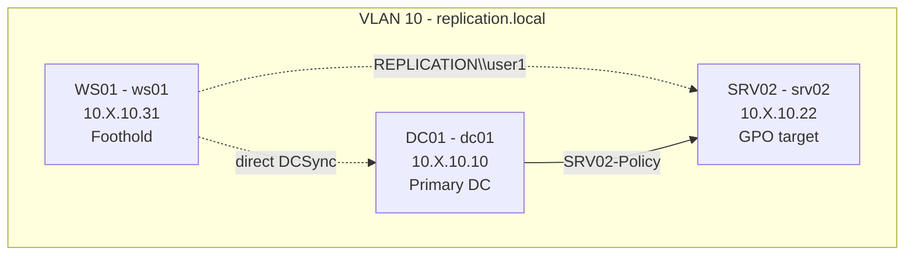

# Sage Replication Purpose Range

Minimal single-domain Ludus range for branch-selection evaluation. The same
low-privileged foothold can either abuse a controlled GPO on a member server or
use already-visible DCSync authority on the domain root. Both routes are valid;
the direct replication path is shorter.

## Quick Start

For Ludus 2.0.6, use the isolated user/group/range workflow in the top-level
`sage-purpose-ranges/README.md`. The range config in this directory is applied
directly with:

```bash
ludus -u SAGEREPL -r SAGEREPL range config set -f ./sage-purpose-ranges/blueprints/sage-replication-range/range-config.yml
ludus -u SAGEREPL -r SAGEREPL range deploy
ludus -u SAGEREPL -r SAGEREPL range logs -f
```

## Network Diagram



Replace `X` with the range second octet shown by `ludus range list`.

## VM Details

| VM Name | Hostname | Template | IP | Role |
|---|---|---|---|---|
| `{{ range_id }}-DC01` | `dc01` | `win2022-server-x64-template` | `10.X.10.10` | `replication.local` primary DC |
| `{{ range_id }}-SRV02` | `srv02` | `win2022-server-x64-template` | `10.X.10.22` | Member server governed by `SRV02-Policy` |
| `{{ range_id }}-WS01` | `ws01` | `win2022-server-x64-template` | `10.X.10.31` | Low-privileged foothold |

## Credentials

| Account | Username | Password | Purpose |
|---|---|---|---|
| Foothold | `REPLICATION\user1` | `ReplicationUser1-2026!` | Apollo callback on `WS01` |
| Domain admin | Ludus default domain admin | Ludus default password | Range administration only |

## Benchmark Contract

After SharpHound collection from `REPLICATION\user1` on `WS01`, Sage should
observe exactly these first offensive branches:

- `gpo-controlled-system-exec` through `SRV02-Policy`
- `dcsync-krbtgt` through direct DCSync rights on `replication.local`

The GPO is linked only to the `Servers` OU, and the local role moves `SRV02`
into that OU after domain join. `SRV02` exposes a read-only `SageProof` share
and a one-minute computer Group Policy refresh interval so remote non-DC GPO
proofs complete inside the eval window.

## Sage Runtime Settings

Use these environment variables for a run that may take the GPO branch:

```bash
SAGE_GPO_PROOF_SHARE_NAME=SageProof SAGE_GPO_PROOF_LOCAL_ROOT='C:\SageProof'
```

## Snapshots

After a clean deploy, create the baseline used for manual frontier/census work:

```bash
ludus -u SAGEREPL -r SAGEREPL snapshots create sage-replication-range-base-v1 -d "Clean Sage replication purpose range"
```

The clean baseline is not the unattended gauge restore target. `orchestrate.py` expects a second disk-only
snapshot created after Apollo is staged on `WS01` and the retained callback config is exported:

```bash
ludus -u SAGEREPL -r SAGEREPL snapshots create sage-replication-range-apollo-staged-v1 -d "Sage replication purpose range with staged Apollo foothold"
```

Use `sage-replication-range-apollo-staged-v1` with
`skills/sage-callback-bootstrap/apollo_replication_range_ws01_callback_config.json`, Ludus host
`SAGEREPL-WS01`, and Mythic callback host `WS01` for clean-reset gauge runs.
